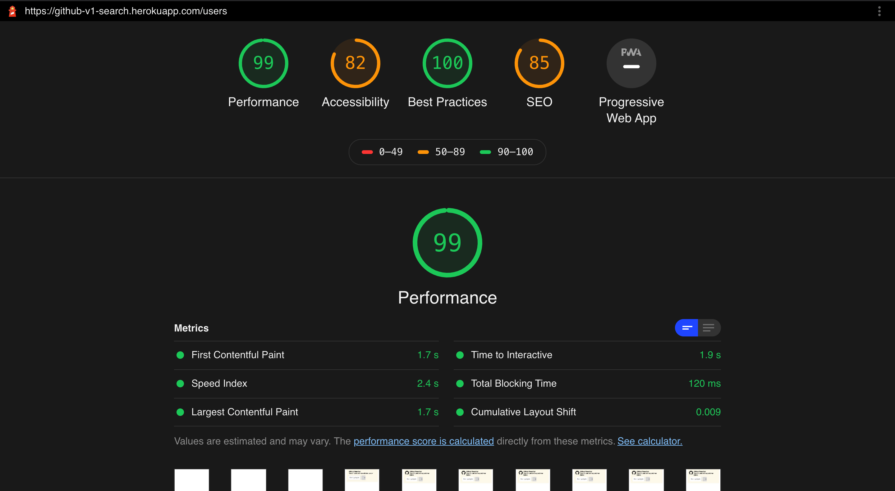

# Github User/Repository Search [Full Stack Solution] [Deployed to Heroku](https://github-v1-search.herokuapp.com)
The solution provides a web interface to user's to search for any user or repository on github, it also exposes the REST Endpoint for same.
Some key features are **server side caching using redis**, [well documented API swagger](https://github-v1-search.herokuapp.com/api-docs/), [application metrics dashboard](https://github-v1-search.herokuapp.com/appmetrics-dash), **client side caching using redux-persist**, **paginated item list with infinite scroll** and **unit & api testing with cypress**.

## To Run Locally
### Env Variables
REDIS_HOST, REDIS_PORT, REDIS_PWD
```bash
clone the repo, install dependencies and npm run dev to run locally.
```

## Frontend

<p align="center">
  
  <h3 align="center">Lighhouse Audit Report</h3>
</p>

```
typescript
react, react-router
redux, redux-thunk
redux-persist - to persist store data
Vanilla CSS
```
Implemented the basic functionality of search across users and repositories, added `skeleton loading` to avoid loaders and blank page, `implemented infinite scroll for pagination (limited to 5 page to check API rate limit)`, `persisted store` and `cache first strategy` before making an API  call.

#### Trade-off
UX for user/repo cards could have been better, also components could have been a bit less coupled.

## Backend

```
typescript
express
express-validator - to escape / sanitize API payload
redis - cache
cypress - unit and api testing
swagger - to document api

Endpoints
Health
GET /api/ping
GET /api/health

Searcg
GET /api/v1/search
1. A client driven endpoint, where client can pass what fields it want (to solve under / over fetching),
2. Though the task mentioned this to be a POST, but I think the usecase is well suited for GET API.

Cache
PUT /clear-cache
1. flushall redis cached data.
```
[Detailed Documentation of API's](https://github-v1-search.herokuapp.com/api-docs/)

well defined typescript **interface** for providers and controllers, singleton class for  **redis provider** to maintain only one connection, testing with **cypress**.

#### Trade-off
*Logging* - the logger class logs to console for now, which should ideally be using a mature logging library as such **winston**, **morgan** or others.

*Monitoring* - Added a default [application metrics dashboard](https://github-v1-search.herokuapp.com/appmetrics-dash) from [here](https://www.npmjs.com/package/appmetrics-dash).

## Abhilash Thakur
[LinkedIn](https://www.linkedin.com/in/abhilash-thakur-b8000395/)
[Github](https://github.com/ThisIsAbhilash)
